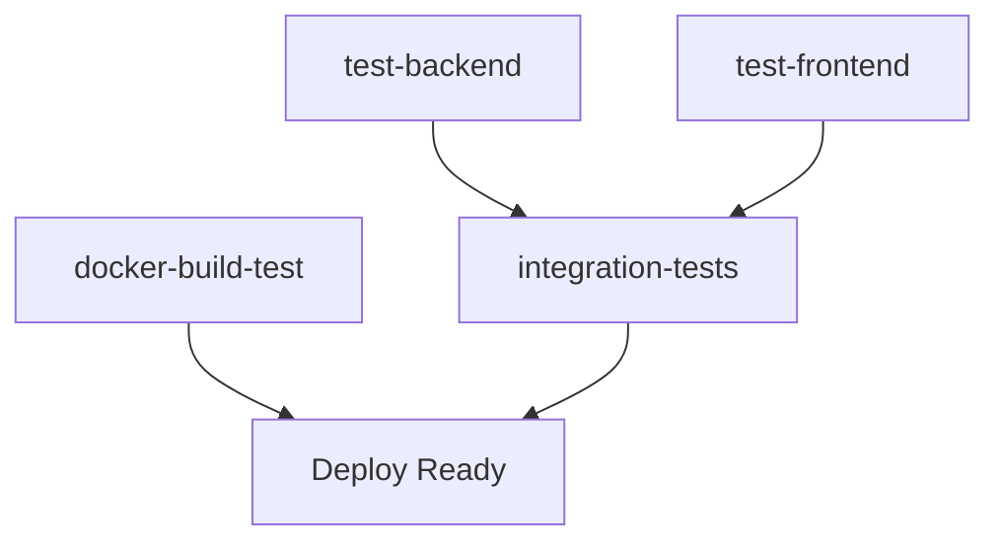

# 📚 Índice de Documentación - STI API

Bienvenido al centro de documentación del proyecto STI API. Aquí encontrarás toda la información necesaria para trabajar con el proyecto.

---

## 🚀 Inicio Rápido

1. **[README.md](README.md)** - Guía principal del proyecto
2. **[Docker Setup](README.md#-puesta-en-marcha-rápida-con-docker)** - Configuración con contenedores
3. **[Manual Setup](README.md#️-configuración-manual)** - Configuración manual

---

## 📋 Documentación Principal

### 🎯 **Esencial**
- **[README.md](README.md)** - Información general y guía de inicio
- **[CHANGELOG.md](CHANGELOG.md)** - Historia de cambios y versiones
- **[SECURITY.md](SECURITY.md)** - Gestión de vulnerabilidades y seguridad

### 🔧 **Técnica Detallada**
- **[CI-CD-IMPROVEMENTS-2025-10-24.md](CI-CD-IMPROVEMENTS-2025-10-24.md)** - Documentación completa de mejoras del pipeline
- **[TESTING-STRATEGY.md](docs/TESTING-STRATEGY.md)** - Portfolio de pruebas automatizadas y manuales
- **[TECHNICAL-ARCHITECTURE-DOCUMENTATION.md](TECHNICAL-ARCHITECTURE-DOCUMENTATION.md)** - Arquitectura técnica completa del sistema
- **[RENDER-FRONTEND-DEPLOY.md](deployment/RENDER-FRONTEND-DEPLOY.md)** - Guía práctica para publicar frontend y backend en Render

### 📁 **Por Módulo**
- **[Backend](backend/README.md)** - API NestJS + TypeORM + PostgreSQL
- **[Frontend](frontend/README.md)** - Aplicación Angular con SSR
- **[Docs](docs/)** - Documentación adicional del proyecto

---

## 🛠️ Herramientas y Scripts

### 🔒 **Seguridad**
| Script | Plataforma | Propósito |
|--------|------------|-----------|
| `scripts/fix/fix-vulnerabilities.ps1` | Windows PowerShell | Gestión completa de vulnerabilidades |
| `scripts/fix/fix-vulnerabilities.sh` | Linux/Mac Bash | Gestión completa de vulnerabilidades |
| `scripts/fix/fix-frontend.bat` | Windows Batch | Arreglo rápido frontend |

### 🧪 **Testing**
| Script | Plataforma | Propósito |
|--------|------------|-----------|
| `scripts/test/test-integration.bat` | Windows | Testing local de integración |
| `scripts/test/test-integration.sh` | Linux/Mac | Testing local de integración |
| `docs/TESTING-STRATEGY.md` | Documento | Estrategia y cobertura de testing |

---

## 🔄 CI/CD Pipeline

### 📊 **Estructura del Pipeline**

### 📝 **Jobs Detallados**
1. **test-backend** - Backend NestJS + linting + security + tests
2. **test-frontend** - Frontend Angular + linting + security + tests  
3. **docker-build-test** - Validación de contenedores
4. **integration-tests** - Orchestración completa + smoke tests

### 📈 **Métricas**
- **Cobertura de código**: Automática con Codecov
- **Vulnerabilidades**: Auditoría no-disruptiva
- **Calidad**: Linting automático
- **Integración**: Tests end-to-end

---

## 🎯 Guías por Contexto

### 👨‍💻 **Para Desarrolladores**

#### 🔧 **Desarrollo Local**
1. [Configuración manual](README.md#️-configuración-manual)
2. [Scripts de desarrollo](README.md#-referencia-rápida-de-comandos)
3. [Testing local](README.md#-scripts-de-automatización)
4. [Arquitectura técnica completa](TECHNICAL-ARCHITECTURE-DOCUMENTATION.md)

#### 🐛 **Debugging & Troubleshooting**
1. [Guía de problemas comunes](README.md#-troubleshooting)
2. [Gestión de vulnerabilidades](SECURITY.md)
3. [Scripts de diagnóstico](CI-CD-IMPROVEMENTS-2025-10-24.md#-archivos-creadosmodificados)

### 🔧 **Para DevOps**

#### 🚀 **Pipeline Management**
1. [Estructura del CI/CD](CI-CD-IMPROVEMENTS-2025-10-24.md#-nuevo-flujo-del-ci-pipeline)
2. [Jobs y configuración](CI-CD-IMPROVEMENTS-2025-10-24.md#️-principales-mejoras-implementadas)
3. [Métricas y monitoring](CI-CD-IMPROVEMENTS-2025-10-24.md#-beneficios-logrados)

#### 🔒 **Security & Compliance**
1. [Gestión de vulnerabilidades](SECURITY.md)
2. [Auditoría automatizada](CI-CD-IMPROVEMENTS-2025-10-24.md#-gestión-de-vulnerabilidades-de-seguridad)
3. [Scripts de automatización](SECURITY.md#️-herramientas-añadidas)

### 📋 **Para Project Managers**

#### 📊 **Métricas y Reportes**
1. [Mejoras implementadas](CI-CD-IMPROVEMENTS-2025-10-24.md#-resumen-ejecutivo)
2. [Beneficios logrados](CI-CD-IMPROVEMENTS-2025-10-24.md#-beneficios-logrados)
3. [ROI y optimizaciones](CI-CD-IMPROVEMENTS-2025-10-24.md#-métricas-de-mejora)

#### 🔮 **Roadmap y Futuro**
1. [Próximas mejoras](CI-CD-IMPROVEMENTS-2025-10-24.md#-próximas-mejoras-sugeridas)
2. [Changelog](CHANGELOG.md#-roadmap)
3. [Versioning strategy](CHANGELOG.md)

---

## 🆘 Soporte y Ayuda

### 🔍 **Problemas Comunes**

| Problema | Solución Rápida | Documentación |
|----------|-----------------|---------------|
| CI falla por vulnerabilidades | `.\scripts\fix\fix-vulnerabilities.ps1 all` | [SECURITY.md](SECURITY.md) |
| Lock files desincronizados | `npm install` en directorio afectado | [README troubleshooting](README.md#-troubleshooting) |
| Integration tests fallan | `.\scripts\test\test-integration.bat` | [Testing local](README.md#-scripts-de-automatización) |
| Puerto ocupado | `netstat` + `taskkill` | [README troubleshooting](README.md#-troubleshooting) |

### 📞 **Escalación**
1. **Revisar documentación** relevante arriba
2. **Ejecutar scripts** de diagnóstico local
3. **Revisar logs** del CI para errores específicos
4. **Consultar** con el equipo de desarrollo

---

## 📈 Estadísticas del Proyecto

### 🏆 **Logros v2.0.0**
- ✅ **6 tipos** de testing automatizado
- ✅ **8 scripts** de automatización creados
- ✅ **50% más rápido** en integration tests
- ✅ **80% más cobertura** de testing
- ✅ **4 jobs** en pipeline CI/CD
- ✅ **Pipeline robusto** y no-disruptivo

### 📊 **Métricas Técnicas**
- **Backend**: NestJS + TypeORM + PostgreSQL + ESLint
- **Frontend**: Angular 18 + SSR + ESLint completo
- **CI/CD**: GitHub Actions con 4 jobs paralelos
- **Testing**: Unit + E2E + Integration + Docker + Smoke
- **Security**: Auditoría automática + scripts de fix
- **Documentation**: 9 archivos de documentación

---

**🎯 Este índice te ayudará a navegar eficientemente toda la documentación del proyecto STI API.**