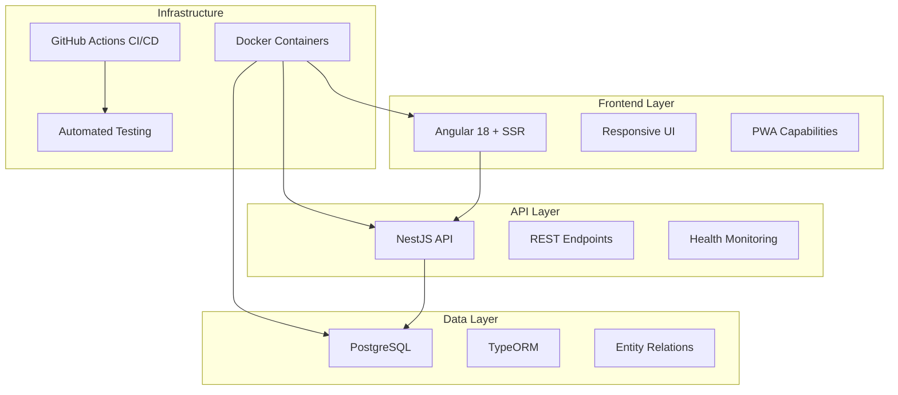
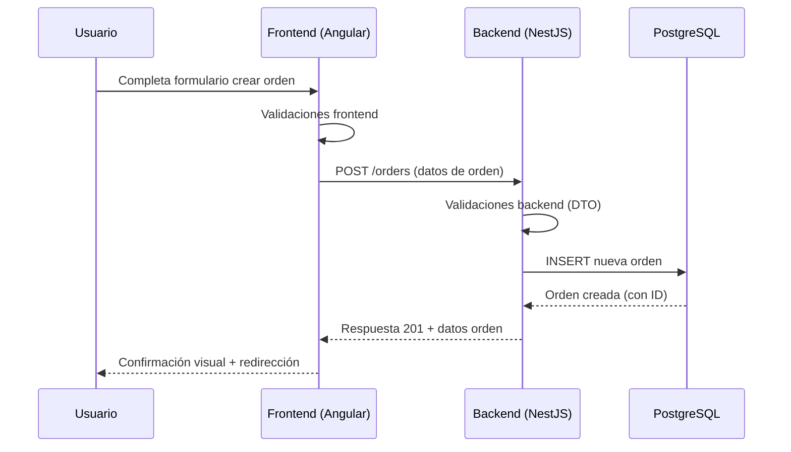
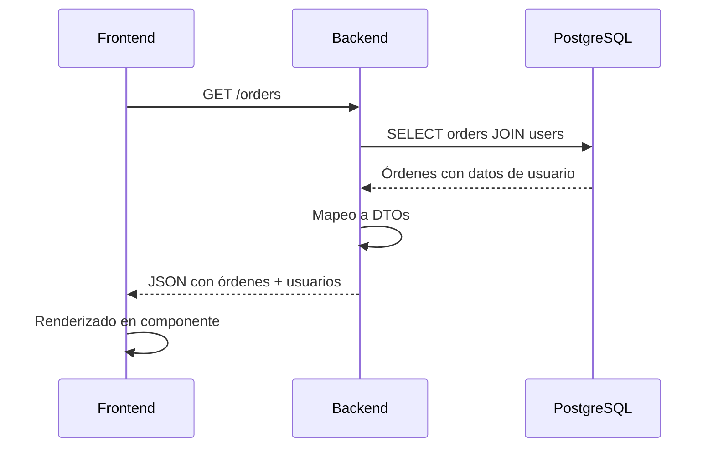
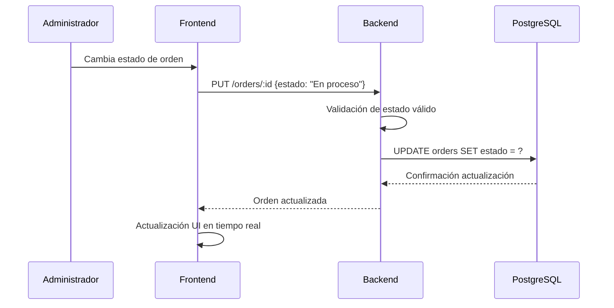

# 🏗️ Arquitectura Técnica Detallada - STI API System
**Documento Técnico Completo**  
**Fecha:** 24 de Octubre, 2025  
**Versión:** 2.0.0  
**Proyecto:** Sistema de Gestión STI (Soporte Técnico Informático)

---

## 📋 Índice

1. [Visión General del Sistema](#-visión-general-del-sistema)
2. [Arquitectura del Backend](#-arquitectura-del-backend)
3. [Arquitectura del Frontend](#-arquitectura-del-frontend)
4. [Base de Datos](#️-base-de-datos)
5. [Infraestructura y DevOps](#-infraestructura-y-devops)
6. [Pipeline CI/CD](#-pipeline-cicd)
7. [Seguridad](#-seguridad)
8. [APIs y Endpoints](#-apis-y-endpoints)
9. [Flujo de Datos](#-flujo-de-datos)
10. [Configuración y Ambiente](#️-configuración-y-ambiente)

---

## 🎯 Visión General del Sistema

### 🏢 **Propósito del Sistema**
**STI API System** es una aplicación completa de gestión para el área de **Soporte Técnico Informático (STI)** que permite:
- 📋 **Gestión de órdenes de trabajo** (tickets de soporte)
- 👥 **Gestión de usuarios** del sistema
- 📊 **Seguimiento de estados** de solicitudes
- 🔄 **Workflow completo** de soporte técnico

### 🏗️ **Arquitectura General**



### 📊 **Stack Tecnológico**

| Capa | Tecnología | Versión | Propósito |
|------|------------|---------|-----------|
| **Frontend** | Angular | 18.2.x | SPA + SSR |
| **Backend** | NestJS | 10.4.x | API REST |
| **Database** | PostgreSQL | 16.x | Base de datos relacional |
| **ORM** | TypeORM | 0.3.x | Mapeo objeto-relacional |
| **Container** | Docker | Latest | Containerización |
| **CI/CD** | GitHub Actions | - | Pipeline automatizado |
| **Testing** | Jest + Karma | Latest | Testing framework |
| **Linting** | ESLint | 8.x | Calidad de código |

---

## 🔧 Arquitectura del Backend

### 📁 **Estructura del Backend**

```
backend/
├── src/
│   ├── main.ts                 # Punto de entrada de la aplicación
│   ├── app.module.ts           # Módulo principal
│   ├── app.controller.ts       # Controlador principal + health endpoint
│   ├── app.service.ts          # Servicio principal
│   ├── orders/                 # Módulo de órdenes
│   │   ├── orders.module.ts    # Configuración del módulo
│   │   ├── orders.controller.ts # Controlador REST
│   │   ├── orders.service.ts    # Lógica de negocio
│   │   ├── entities/
│   │   │   └── order.entity.ts # Entidad TypeORM
│   │   └── dto/                # Data Transfer Objects
│   │       ├── create-orders.dto.ts
│   │       ├── update-order.dto.ts
│   │       └── query-orders.dto.ts
│   └── users/                  # Módulo de usuarios
│       ├── users.module.ts     # Configuración del módulo
│       ├── users.controller.ts # Controlador REST
│       ├── users.service.ts    # Lógica de negocio
│       ├── entities/
│       │   └── user.entity.ts  # Entidad TypeORM
│       ├── dto/
│       │   └── create-users.dto/
│       └── interfaces/
│           └── user.interface.ts
├── test/                       # Tests E2E
│   ├── app.e2e-spec.ts        # Test de integración
│   ├── jest-e2e.json          # Config Jest E2E
│   └── jest-integration.json   # Config Jest integración
├── package.json               # Dependencias y scripts
├── tsconfig.json             # Configuración TypeScript
├── nest-cli.json             # Configuración NestJS CLI
├── Dockerfile                # Imagen de contenedor
└── .env.example              # Variables de entorno
```

### 🎯 **Módulos Principales**

#### 1. **AppModule** (Módulo Principal)
```typescript
@Module({
  imports: [
    ConfigModule.forRoot({
      isGlobal: true,
      envFilePath: process.env.NODE_ENV === 'test' ? '.env.test' : '.env',
    }),
    TypeOrmModule.forRoot({
      type: 'postgres',
      // Configuración de base de datos
    }),
    UsersModule,
    OrdersModule,
  ]
})
```

**Responsabilidades:**
- ✅ **Configuración global** de la aplicación
- ✅ **Gestión de variables** de entorno
- ✅ **Configuración de TypeORM** (ORM)
- ✅ **Importación de módulos** funcionales

#### 2. **OrdersModule** (Gestión de Órdenes)
```typescript
// Funcionalidades:
- CRUD completo de órdenes de trabajo
- Relación con usuarios (Many-to-One)
- Estados de órdenes (En espera, En proceso, Completada)
- Filtros y consultas personalizadas
```

**Entidad Order:**
```typescript
@Entity()
export class Order {
  @PrimaryGeneratedColumn()
  id: number;
  
  @Column()
  name: string;          // Nombre de la orden
  
  @Column()
  priority: string;      // Prioridad (Alta, Media, Baja)
  
  @Column()
  description: string;   // Descripción principal
  
  @Column()
  description2: string;  // Descripción adicional
  
  @Column({ default: 'En espera' })
  estado: string;        // Estado de la orden
  
  @Column({ default: true })
  isActive: boolean;     // Soft delete
  
  @ManyToOne(() => User, user => user.orders)
  user: User;           // Usuario asignado
}
```

#### 3. **UsersModule** (Gestión de Usuarios)
```typescript
// Funcionalidades:
- CRUD completo de usuarios
- Relación con órdenes (One-to-Many)
- Información de contacto (email, teléfono)
- Gestión de institutos/departamentos
```

**Entidad User:**
```typescript
@Entity()
export class User {
  @PrimaryGeneratedColumn()
  id: number;
  
  @Column()
  name: string;          // Nombre del usuario
  
  @Column()
  institute: string;     // Instituto/Departamento
  
  @Column({ nullable: true })
  mail: string;          // Email de contacto
  
  @Column({ nullable: true })
  cel: number;           // Teléfono
  
  @Column({ default: true })
  isActive: boolean;     // Soft delete
  
  @OneToMany(() => Order, order => order.user)
  orders: Order[];       // Órdenes asignadas
}
```

### 🔌 **Endpoints del Backend**

#### **Endpoints Principales:**
```http
# Health Check
GET    /health              # Estado del servicio

# Users
GET    /users               # Listar usuarios
POST   /users               # Crear usuario
GET    /users/:id          # Obtener usuario
PUT    /users/:id          # Actualizar usuario
DELETE /users/:id          # Eliminar usuario

# Orders  
GET    /orders              # Listar órdenes
POST   /orders              # Crear orden
GET    /orders/:id         # Obtener orden
PUT    /orders/:id         # Actualizar orden
DELETE /orders/:id         # Eliminar orden
```

### ⚙️ **Configuración del Backend**

#### **Variables de Entorno:**
```bash
# Database
DB_HOST=localhost
DB_PORT=5432
DB_USERNAME=postgres
DB_PASSWORD=secret123!
DB_DATABASE=sticct

# Application  
NODE_ENV=development
PORT=3000

# TypeORM
TYPEORM_SSL=false
```

#### **Scripts npm:**
```json
{
  "start": "nest start",
  "start:dev": "nest start --watch",
  "start:prod": "node dist/main",
  "build": "nest build",
  "test": "jest",
  "test:e2e": "jest --config ./test/jest-e2e.json",
  "lint": "eslint \"{src,apps,libs,test}/**/*.ts\" --fix",
  "security:check": "npm audit --audit-level high"
}
```

---

## 🌐 Arquitectura del Frontend

### 📁 **Estructura del Frontend**

```
frontend/
├── src/
│   ├── app/
│   │   ├── app.component.ts          # Componente principal
│   │   ├── app.routes.ts             # Configuración de rutas
│   │   ├── app.config.ts             # Configuración de la app
│   │   ├── sti-data.service.ts       # Servicio de datos principal
│   │   ├── home/                     # Página de inicio
│   │   │   ├── home.component.ts
│   │   │   ├── home.component.html
│   │   │   └── home.component.scss
│   │   ├── user-list/                # Lista de usuarios
│   │   │   ├── user-list.component.ts
│   │   │   ├── user.ts               # Modelo/Interfaz
│   │   │   └── ...
│   │   ├── create-user/              # Crear usuario
│   │   │   └── ...
│   │   ├── order-list/               # Lista de órdenes
│   │   │   ├── order-list.component.ts
│   │   │   ├── order.ts              # Modelo/Interfaz
│   │   │   └── ...
│   │   ├── create-order/             # Crear orden
│   │   │   └── ...
│   │   └── about-us/                 # Página "Acerca de"
│   │       └── ...
│   ├── environments/                 # Configuración de entornos
│   │   ├── environment.ts            # Desarrollo
│   │   └── environment.prod.ts       # Producción
│   ├── index.html                    # HTML principal
│   ├── main.ts                       # Bootstrap de la aplicación
│   ├── main.server.ts                # Bootstrap SSR
│   └── styles.scss                   # Estilos globales
├── public/
│   └── assets/                       # Recursos estáticos
│       ├── logo7.jpg
│       ├── MONITOR.png
│       └── ...
├── angular.json                      # Configuración Angular
├── package.json                      # Dependencias y scripts
├── tsconfig.json                     # Configuración TypeScript
├── karma.conf.cjs                    # Configuración testing
├── server.ts                         # Servidor SSR
├── Dockerfile                        # Imagen de contenedor
└── .eslintrc.json                    # Configuración ESLint
```

### 🎯 **Componentes Principales**

#### 1. **AppComponent** (Componente Raíz)
```typescript
// Responsabilidades:
- Layout principal de la aplicación
- Navegación global
- Routing outlet
- Header/Footer comunes
```

#### 2. **StiDataService** (Servicio de Datos)
```typescript
@Injectable({
  providedIn: 'root'
})
export class StiDataService {
  private URL_USERS = `${environment.apiUrl}/users`;
  private URL_ORDERS = `${environment.apiUrl}/orders`;

  // Métodos CRUD para Users
  getAllUsers(): Observable<User[]>
  createUser(userData: any): Observable<any>
  deleteUser(id: number): Observable<any>
  
  // Métodos CRUD para Orders
  getAllOrders(): Observable<Order[]>
  createOrder(orderData: any): Observable<any>
  deleteOrder(id: number): Observable<any>
  UpdateOrder(id: number, order: any): Observable<any>
}
```

#### 3. **Módulos Funcionales**

##### **UserListComponent**
```typescript
// Funcionalidades:
- Lista todos los usuarios del sistema
- Paginación y filtros
- Acciones: Ver, Editar, Eliminar
- Navegación a crear nuevo usuario
```

##### **CreateUserComponent**  
```typescript
// Funcionalidades:
- Formulario reactivo para crear usuarios
- Validaciones de campos
- Integración con StiDataService
- Redirección después de crear
```

##### **OrderListComponent**
```typescript
// Funcionalidades:
- Lista todas las órdenes de trabajo
- Filtros por estado, prioridad
- Asignación de usuarios
- Cambio de estados
```

##### **CreateOrderComponent**
```typescript
// Funcionalidades:
- Formulario para crear órdenes
- Selección de usuario asignado
- Configuración de prioridades
- Validaciones de negocio
```

##### **HomeComponent**
```typescript
// Funcionalidades:
- Dashboard principal
- Resumen de estadísticas
- Enlaces a funcionalidades principales
- Información del sistema STI
```

### 🔄 **Routing y Navegación**

```typescript
export const routes: Routes = [
  { path: '', redirectTo: '/home', pathMatch: 'full' },
  { path: 'home', component: HomeComponent },
  { path: 'users', component: UserListComponent },
  { path: 'createUsers', component: CreateUserComponent },
  { path: 'orders', component: OrderListComponent },
  { path: 'createOrders', component: CreateOrderComponent },
  { path: 'about', component: AboutUsComponent }
];
```

### 🎨 **Modelos de Datos (Frontend)**

#### **User Interface:**
```typescript
export interface User {
  id: number;
  name: string;
  institute: string;
  mail: string;
  cel: number;
  isActive: boolean;
  orders?: Order[];
}
```

#### **Order Interface:**
```typescript
export interface Order {
  id: number;
  name: string;
  priority: string;
  description: string;
  description2: string;
  estado: string;
  isActive: boolean;
  user?: User;
}
```

### ⚙️ **Configuración del Frontend**

#### **Environments:**
```typescript
// environment.ts (Desarrollo)
export const environment = {
  production: false,
  apiUrl: 'http://localhost:3000'
};

// environment.prod.ts (Producción)
export const environment = {
  production: true,
  apiUrl: 'https://api.sti-system.com'
};
```

#### **Angular Configuration:**
```json
{
  "projects": {
    "STI-CCT": {
      "projectType": "application",
      "architect": {
        "build": {
          "builder": "@angular-devkit/build-angular:application",
          "options": {
            "server": "src/main.server.ts",
            "prerender": true,
            "ssr": {
              "entry": "server.ts"
            }
          }
        }
      }
    }
  }
}
```

---

## 🗄️ Base de Datos

### 📊 **Esquema de Base de Datos**

```sql
-- Diagrama de entidades
┌─────────────────┐         ┌─────────────────┐
│      users      │         │     orders      │
├─────────────────┤         ├─────────────────┤
│ id (PK)        │◄────────┤ id (PK)        │
│ name           │   1:N   │ name           │
│ institute      │         │ priority       │
│ mail           │         │ description    │
│ cel            │         │ description2   │
│ isActive       │         │ estado         │
│                │         │ isActive       │
│                │         │ id_user (FK)   │
└─────────────────┘         └─────────────────┘
```

### 🏗️ **Estructura de Tablas**

#### **Tabla: users**
```sql
CREATE TABLE users (
    id SERIAL PRIMARY KEY,
    name VARCHAR(255) NOT NULL,
    institute VARCHAR(255) NOT NULL,
    mail VARCHAR(255),
    cel INTEGER,
    isActive BOOLEAN DEFAULT true
);
```

#### **Tabla: orders**
```sql
CREATE TABLE orders (
    id SERIAL PRIMARY KEY,
    name VARCHAR(255) NOT NULL,
    priority VARCHAR(100) NOT NULL,
    description TEXT NOT NULL,
    description2 TEXT NOT NULL,
    estado VARCHAR(100) DEFAULT 'En espera',
    isActive BOOLEAN DEFAULT true,
    id_user INTEGER REFERENCES users(id)
);
```

### 🔗 **Relaciones**

1. **User ↔ Orders (1:N)**
   - Un usuario puede tener múltiples órdenes
   - Una orden pertenece a un usuario específico
   - Relación opcional (orders pueden existir sin usuario asignado)

### 📋 **Estados de Órdenes**

| Estado | Descripción |
|--------|-------------|
| `En espera` | Orden recién creada, pendiente de asignación |
| `En proceso` | Orden asignada y en desarrollo |
| `Completada` | Orden finalizada exitosamente |
| `Cancelada` | Orden cancelada por cualquier motivo |

### 🔧 **Configuración TypeORM**

```typescript
TypeOrmModule.forRoot({
  type: 'postgres',
  host: process.env.DB_HOST || 'localhost',
  port: parseInt(process.env.DB_PORT ?? '5432', 10),
  username: process.env.DB_USERNAME || 'postgres',
  password: process.env.DB_PASSWORD || 'secret123!',
  database: process.env.DB_DATABASE || 'sticct',
  ssl: process.env.TYPEORM_SSL === 'true',
  synchronize: true,        // ⚠️ Solo en desarrollo
  autoLoadEntities: true,
  entities: [Order, User],
})
```

---

## 🐳 Infraestructura y DevOps

### 🏗️ **Docker Compose Architecture**

```yaml
# Servicios definidos en docker-compose.yml
services:
  backend:     # API NestJS
  frontend:    # Angular App  
  postgres:    # Base de datos
  adminer:     # Administrador DB (opcional)
```

#### **Servicio Backend:**
```yaml
backend:
  build:
    context: ./backend
    dockerfile: Dockerfile
  command: npm run start:dev
  ports:
    - "3000:3000"
  environment:
    - DB_HOST=postgres
    - DB_PASSWORD=secret123!
  depends_on:
    - postgres
  volumes:
    - ./backend:/app
    - /app/node_modules
```

#### **Servicio Frontend:**
```yaml
frontend:
  build:
    context: ./frontend
    dockerfile: Dockerfile
  command: ng serve --host 0.0.0.0 --poll 2000
  ports:
    - "4200:4200"
  depends_on:
    - backend
  volumes:
    - ./frontend:/app
    - /app/node_modules
```

#### **Servicio PostgreSQL:**
```yaml
postgres:
  image: postgres:16
  environment:
    - POSTGRES_USER=postgres
    - POSTGRES_PASSWORD=secret123!
    - POSTGRES_DB=sticct
  ports:
    - "5432:5432"
  volumes:
    - postgres-data:/var/lib/postgresql/data
```

### 📦 **Dockerfiles**

#### **Backend Dockerfile:**
```dockerfile
FROM node:20-alpine
WORKDIR /app
COPY package*.json ./
RUN npm ci --only=production
COPY . .
RUN npm run build
EXPOSE 3000
CMD ["npm", "run", "start:prod"]
```

#### **Frontend Dockerfile:**
```dockerfile
FROM node:20-alpine
WORKDIR /app
COPY package*.json ./
RUN npm ci
COPY . .
RUN npm run build
EXPOSE 4200
CMD ["npm", "start"]
```

---

## 🔄 Pipeline CI/CD

### 🏗️ **Estructura del Pipeline**

```yaml
# .github/workflows/ci.yml
name: CI
on: [push, pull_request]

jobs:
  test-backend:      # Tests del backend + linting + seguridad
  test-frontend:     # Tests del frontend + linting + seguridad  
  docker-build-test: # Validación de contenedores
  integration-tests: # Tests de integración completa
```

### 🧪 **Job: test-backend**

```yaml
steps:
  - name: Install dependencies
  - name: Security audit (non-blocking)
  - name: Run lint (ESLint + TypeScript)
  - name: Run E2E tests (with PostgreSQL)
  - name: Run unit tests + coverage
  - name: Upload coverage to Codecov
```

**Servicios:**
- PostgreSQL 16 para tests E2E
- Variables de entorno de testing

### 🌐 **Job: test-frontend**

```yaml
steps:
  - name: Install dependencies (with fallback)
  - name: Security audit  
  - name: Run lint (Angular + templates)
  - name: Run unit tests + coverage
  - name: Build verification
  - name: Upload coverage to Codecov
```

**Características:**
- Chrome Headless para testing
- Manejo automático de lock files
- ESLint para Angular y templates

### 🐳 **Job: docker-build-test**

```yaml
steps:
  - name: Test Backend Docker build
  - name: Test Frontend Docker build
  - name: Basic container validation
```

### 🔗 **Job: integration-tests**

```yaml
needs: [test-backend, test-frontend]
steps:
  - name: Start backend (development mode)
  - name: Start frontend  
  - name: Health checks with timeouts
  - name: Smoke tests (curl endpoints)
```

**Optimización:**
- Modo desarrollo (sin build) para 50% más velocidad
- Health checks robustos con timeouts
- Smoke tests de conectividad

### 📊 **Métricas del Pipeline**

| Métrica | Valor |
|---------|-------|
| **Tiempo total** | ~8-12 minutos |
| **Jobs paralelos** | 3 (backend, frontend, docker) |
| **Cobertura mínima** | 80% |
| **Vulnerabilidades** | Auditoría no-bloqueante |
| **Linting** | 100% de archivos |

---

## 🔒 Seguridad

### 🛡️ **Gestión de Vulnerabilidades**

#### **Auditoría Automatizada:**
```yaml
# En CI Pipeline
- name: Security audit
  run: npm audit --audit-level moderate || echo "Vulnerabilities found"
  continue-on-error: true
```

#### **Scripts de Remediación:**
```bash
# Automatización local
fix-vulnerabilities.ps1    # PowerShell
fix-vulnerabilities.sh     # Bash
fix-frontend.bat          # Windows batch
```

### 🔐 **Variables de Entorno Seguras**

#### **Desarrollo:**
```bash
DB_PASSWORD=secret123!      # ⚠️ Solo desarrollo
JWT_SECRET=dev-secret       # ⚠️ Solo desarrollo
NODE_ENV=development
```

#### **Producción:**
```bash
DB_PASSWORD=${PROD_DB_PASSWORD}    # Desde secrets
JWT_SECRET=${PROD_JWT_SECRET}      # Desde secrets  
NODE_ENV=production
SSL_ENABLED=true
```

### 🔍 **Health Monitoring**

```typescript
@Get('health')
getHealth(): object {
  return {
    status: 'ok',
    timestamp: new Date().toISOString(),
    service: 'STI API Backend',
    version: process.env.APP_VERSION,
    database: 'connected'  // TODO: Add DB health check
  };
}
```

---

## 🌐 APIs y Endpoints

### 📡 **API REST Documentation**

#### **Base URL:**
- **Desarrollo:** `http://localhost:3000`
- **Producción:** `https://api.sti-system.com`

#### **Headers Comunes:**
```http
Content-Type: application/json
Accept: application/json
```

### 👥 **Users API**

#### **GET /users**
```http
GET /users
Response: 200 OK
[
  {
    "id": 1,
    "name": "Juan Pérez",
    "institute": "Sistemas",
    "mail": "juan@example.com", 
    "cel": 1234567890,
    "isActive": true,
    "orders": []
  }
]
```

#### **POST /users**
```http
POST /users
Content-Type: application/json

{
  "name": "María García",
  "institute": "Desarrollo", 
  "mail": "maria@example.com",
  "cel": 9876543210
}

Response: 201 Created
{
  "id": 2,
  "name": "María García",
  "institute": "Desarrollo",
  "mail": "maria@example.com",
  "cel": 9876543210,
  "isActive": true
}
```

#### **DELETE /users/:id**
```http
DELETE /users/1
Response: 200 OK
{
  "message": "User deleted successfully",
  "id": 1
}
```

### 📋 **Orders API**

#### **GET /orders**
```http
GET /orders
Response: 200 OK
[
  {
    "id": 1,
    "name": "Instalación de software",
    "priority": "Alta",
    "description": "Instalar Office 365",
    "description2": "En sala de profesores",
    "estado": "En espera",
    "isActive": true,
    "user": {
      "id": 1,
      "name": "Juan Pérez"
    }
  }
]
```

#### **POST /orders**
```http
POST /orders
Content-Type: application/json

{
  "name": "Reparación de impresora",
  "priority": "Media",
  "description": "Impresora no imprime",
  "description2": "Oficina 201",
  "userId": 1
}

Response: 201 Created
{
  "id": 2,
  "name": "Reparación de impresora",
  "priority": "Media", 
  "description": "Impresora no imprime",
  "description2": "Oficina 201",
  "estado": "En espera",
  "isActive": true,
  "user": {
    "id": 1,
    "name": "Juan Pérez"
  }
}
```

#### **PUT /orders/:id**
```http
PUT /orders/2
Content-Type: application/json

{
  "estado": "En proceso",
  "priority": "Alta"
}

Response: 200 OK
{
  "id": 2,
  "estado": "En proceso",
  "priority": "Alta",
  // ... otros campos
}
```

### 🔍 **Health Check API**

#### **GET /health**
```http
GET /health
Response: 200 OK
{
  "status": "ok",
  "timestamp": "2025-10-24T15:30:00.000Z",
  "service": "STI API Backend"
}
```

---

## 📊 Flujo de Datos

### 🔄 **Flujo de Creación de Orden**



### 🔄 **Flujo de Listado con Relaciones**



### 🔄 **Flujo de Actualización de Estado**



---

## ⚙️ Configuración y Ambiente

### 🌍 **Variables de Entorno**

#### **Backend (.env):**
```bash
# Database
DB_HOST=localhost
DB_PORT=5432
DB_USERNAME=postgres
DB_PASSWORD=secret123!
DB_DATABASE=sticct

# Application
NODE_ENV=development
PORT=3000

# TypeORM
TYPEORM_SSL=false
TYPEORM_SYNCHRONIZE=true  # ⚠️ Solo desarrollo

# Security (para futuro)
JWT_SECRET=your-secret-key
CORS_ORIGINS=http://localhost:4200
```

#### **Backend Testing (.env.test):**
```bash
DB_HOST=localhost
DB_PORT=5432
DB_USERNAME=postgres
DB_PASSWORD=secret123!
DB_DATABASE=sticct_test
NODE_ENV=test
```

### 🚀 **Scripts de Desarrollo**

#### **Backend (package.json):**
```json
{
  "scripts": {
    "start": "nest start",
    "start:dev": "nest start --watch",
    "start:prod": "node dist/main",
    "build": "nest build",
    "test": "jest",
    "test:watch": "jest --watch",
    "test:cov": "jest --coverage",
    "test:e2e": "jest --config ./test/jest-e2e.json",
    "lint": "eslint \"{src,apps,libs,test}/**/*.ts\" --fix",
    "security:check": "npm audit --audit-level high",
    "security:fix": "npm audit fix"
  }
}
```

#### **Frontend (package.json):**
```json
{
  "scripts": {
    "ng": "ng",
    "start": "ng serve",
    "build": "ng build --configuration production",
    "test": "ng test",
    "test:cov": "ng test --watch=false --code-coverage --browsers=ChromeHeadless",
    "lint": "ng lint",
    "serve:ssr": "node dist/sticct/server/server.mjs"
  }
}
```

### 🔧 **Configuraciones de Desarrollo**

#### **TypeScript (tsconfig.json):**
```json
{
  "compilerOptions": {
    "target": "ES2022",
    "module": "commonjs",
    "lib": ["ES2022"],
    "experimentalDecorators": true,
    "emitDecoratorMetadata": true,
    "strict": true,
    "esModuleInterop": true,
    "skipLibCheck": true,
    "forceConsistentCasingInFileNames": true
  }
}
```

#### **ESLint Configuration:**
```json
{
  "extends": [
    "eslint:recommended",
    "@typescript-eslint/recommended",
    "@angular-eslint/recommended"
  ],
  "rules": {
    "@typescript-eslint/no-unused-vars": "error",
    "@angular-eslint/component-selector": [
      "error",
      { "type": "element", "prefix": "app", "style": "kebab-case" }
    ]
  }
}
```

---

## 📈 Métricas y Monitoring

### 📊 **Métricas del Sistema**

| Componente | Métrica | Valor Objetivo |
|------------|---------|----------------|
| **API Response Time** | Promedio | < 200ms |
| **Database Queries** | Promedio | < 100ms |
| **Frontend Load** | First Paint | < 2s |
| **Test Coverage** | Backend | > 85% |
| **Test Coverage** | Frontend | > 80% |
| **Build Time** | CI Pipeline | < 10min |

### 🏥 **Health Checks**

```typescript
// Backend Health Check
@Get('health')
getHealth(): HealthStatus {
  return {
    status: 'ok',
    timestamp: new Date().toISOString(),
    service: 'STI API Backend',
    database: await this.checkDatabaseConnection(),
    memory: process.memoryUsage(),
    uptime: process.uptime()
  };
}
```

### 📊 **Logging Strategy**

```typescript
// Logger configuration
const logger = new Logger('Application');

// Request logging
app.use((req, res, next) => {
  logger.log(`${req.method} ${req.url} - ${req.ip}`);
  next();
});

// Error logging  
app.use((error, req, res, next) => {
  logger.error(`Error: ${error.message}`, error.stack);
  next(error);
});
```

---

## 🔮 Roadmap y Mejoras Futuras

### 📋 **Próximas Funcionalidades**

#### **v2.1.0 - Q1 2026**
- [ ] **Autenticación y autorización** (JWT)
- [ ] **Roles de usuario** (Admin, Técnico, Usuario)
- [ ] **Notificaciones** en tiempo real (WebSockets)
- [ ] **Dashboard analytics** con gráficos

#### **v2.2.0 - Q2 2026**  
- [ ] **API de comentarios** en órdenes
- [ ] **Historial de cambios** (audit log)
- [ ] **Búsqueda avanzada** y filtros
- [ ] **Exportación** de reportes (PDF, Excel)

#### **v2.3.0 - Q3 2026**
- [ ] **Mobile app** (React Native / Flutter)
- [ ] **Integración con calendar** (Google Calendar)
- [ ] **Chatbot** de soporte básico
- [ ] **Métricas avanzadas** y reportes

### 🏗️ **Mejoras Técnicas**

#### **Performance**
- [ ] **Redis caching** para consultas frecuentes
- [ ] **Database indexing** optimizado
- [ ] **Lazy loading** en frontend
- [ ] **CDN** para assets estáticos

#### **Security**
- [ ] **Rate limiting** en API
- [ ] **Input sanitization** mejorado
- [ ] **HTTPS** obligatorio en producción
- [ ] **Security headers** (CORS, CSP, etc.)

#### **DevOps**
- [ ] **Kubernetes** deployment
- [ ] **Monitoring** con Prometheus/Grafana
- [ ] **Blue-green** deployment
- [ ] **Automated backup** de base de datos

---

## 📞 Contacto y Soporte Técnico

### 👨‍💻 **Equipo de Desarrollo**
- **Project Lead:** [Definir]
- **Backend Developer:** [Definir]  
- **Frontend Developer:** [Definir]
- **DevOps Engineer:** [Definir]

### 📚 **Recursos de Documentación**
- **[README.md](README.md)** - Guía de inicio rápido
- **[SECURITY.md](SECURITY.md)** - Gestión de vulnerabilidades
- **[CHANGELOG.md](CHANGELOG.md)** - Historia de versiones
- **[CI-CD-IMPROVEMENTS-2025-10-24.md](CI-CD-IMPROVEMENTS-2025-10-24.md)** - Mejoras del pipeline

### 🆘 **Soporte Técnico**
1. **Revisar documentación** técnica
2. **Ejecutar scripts** de diagnóstico
3. **Consultar logs** del sistema  
4. **Escalamiento** al equipo técnico

---

**📋 Este documento proporciona una visión técnica completa del Sistema STI API, incluyendo arquitectura, componentes, APIs, configuraciones y procedimientos operativos.**